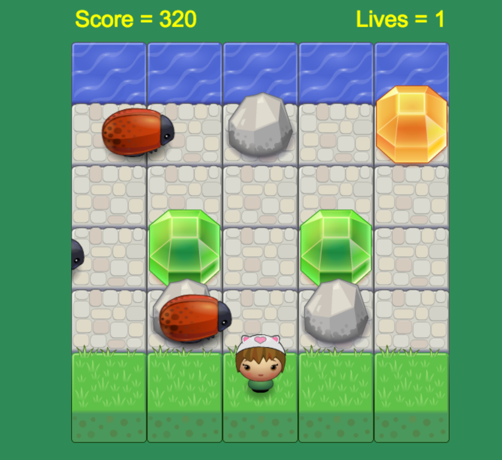

<h1>
<b> FroggerJS </b> 
</h1>

<h3> By: Learnathoner </h3>

### To start the game, click [here](https://learnathoner.github.io/frontend-nanodegree-arcade-game/)

## **Gameplay Guide**

### Welcome Screen

This is a welcome screen. Don't worry, it goes away.

### Character Selection Screen

Choose your character here! Use the **Left and Right** arrow keys to change characters, select the one you like by pressing **Enter.**

### Gameplay

* Use the **Up, Down, Left, and Right** arrow keys to move.
* Try to avoid the critters and make it to the other side!
* At a certain level, gems are introduced. Get them.
* Rocks are... rocks. You don't go through them, unlike the magical ladybugs.

### Lose Screen

You're bound to get here eventually. You've got two options:
* **Try Again** - Starts over with the same character.
* **Restart** - Brings you back to the character selection screen.

## **Code Guide**

For an in-depth guide to the code and how it works, take a look at my [Code Guide](codeREADME.md).
